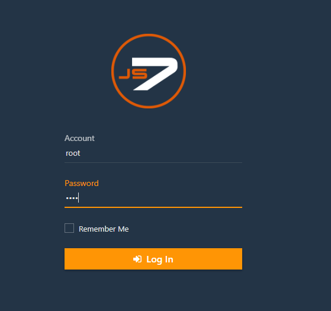
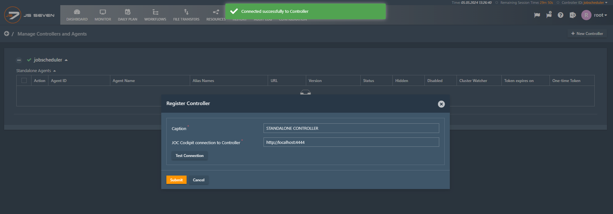
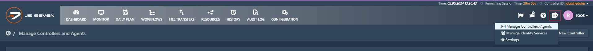
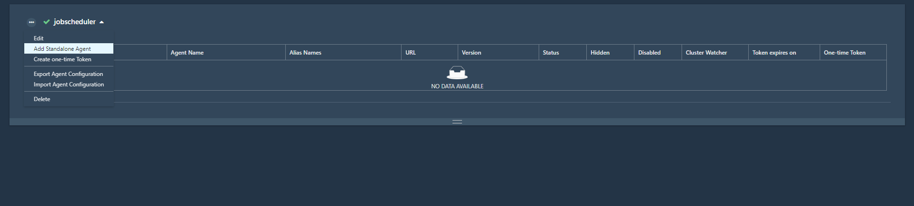
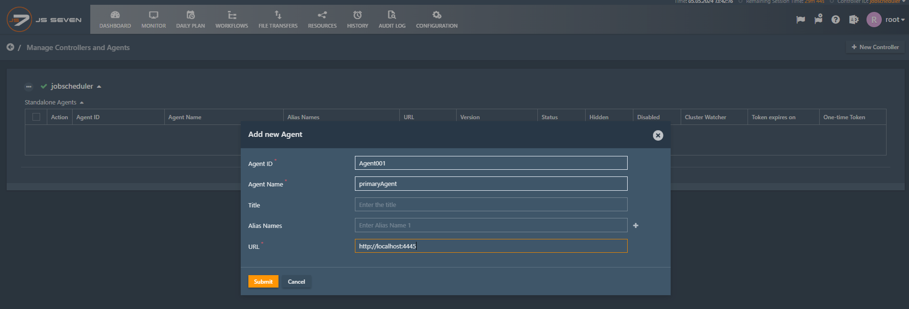
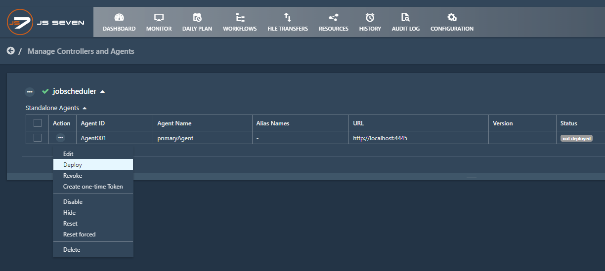
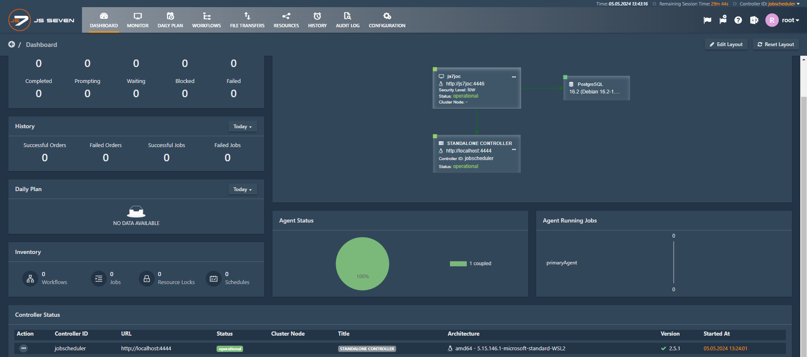

# Getting Started
0. `cd js7/`
1. install [cloudNativePG](https://github.com/cloudnative-pg/cloudnative-pg/tree/main/releases "find the list of releases") kubernetes operator `kubectl apply --server-side -f https://raw.githubusercontent.com/cloudnative-pg/cloudnative-pg/release-1.23/releases/cnpg-1.23.1.yaml`
2. create database `kubectl apply -f js7-postgres.yaml`
3. create configmap to mount the hibernate.cfg.xml file with db credentials `./scripts/update_hibernate_config.sh`
4. deploy the controller, agent, & joc pods `kubectl apply -f js7-deployment.yaml`
5. deploy services `kubectl apply -f js7-service.yaml`
6. install database tables `kubectl exec -it js7joc -c js7joc -- bash -c /opt/sos-berlin.com/js7/joc/install/joc_install_tables.sh`

# [JS7 login](http://localhost:4446/)
Inital username and password will be `root`.<br>


<br>

# [Initial Operation](https://kb.sos-berlin.com/display/JS7/JS7+-+Initial+Operation)







<br>

# LATER
create generic secret for js7 db user
```shell
kubectl create secret generic js7-user-credentials \ 
--from-literal=username=JS7_USER \
--from-literal=password=JS7_USER \
--dry-run=client -o yaml > js7-user-credentials.yaml
```
create configmap containing js7 init sql
```shell
kubectl create configmap js7-sql-script \
--from-file=pgsql.sql --dry-run=client -o yaml > js7-sql-script.yaml
``` 

